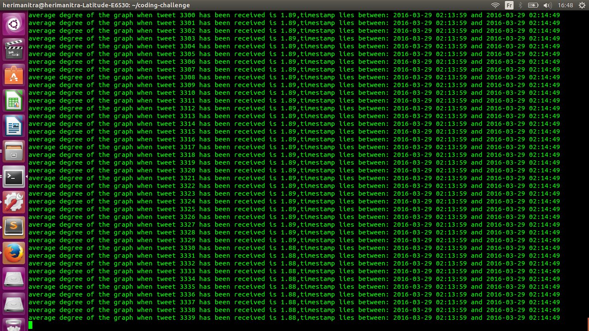

Insight Data Engineering - Coding Challenge (my solution)
===========================================================

## Package dependencies:

You will need to install `numpy` and `pandas` :

* `pip install numpy`

* `pip install pandas`

## To run the script:
On the cli inside `coding-challenge` directory, enter: 

`bash run.sh` 
(ensure you have correct permission otherwise add `sudo` before `bash`)

`average_degree.py` implements the algorithm and takes exactly 02 arguments from the cli:

* input location : `tweet_input/tweets.txt` and
* output location: `tweet_output/output.txt`

### Monitor progress on the cli:

You should see stuff like this:

## Algorithm (details implementation):

1. A function reads data from `tweets.txt` and parses it so that built-in function from `pandas` package can easily transform it into a dataframe.

2. A function  extracts hashtags for each tweet and stores them in a `python list`. This `python list` has exactly the same length as the `timestamp list` to ensure time
consistency during streaming.

3. A third function handles streaming of tweets by calling 03 functions.

 * First tweet is processed then first 02 tweets then first three tweets and so on until the `n` tweets.

 * First function of this streaming process ensures that tweets currently processed belong to 60 seconds most recent tweets.

 * Second function of this streaming process generates graph (a dictionnary data structure in `python`) that corresponds to current tweets.

 * Third function of this streaming process calculates average degree of current nodes (each node corresponds to a `hashtag`, each node corresponds to a key of the dictionnary where values are list of connected nodes ):

 * The idea of the calculation is to replace values of each key by their number(#) of elements then average the all. 

## Unit Tests covered:

I implement 03 additional unit tests:

* Test for two consecutive tweets with no hashtag `passed`! Expected output are `0.00` and `0.00`

* Test for two consecutive tweets with 02 hashtags with exactly the same hashtags `passed`! Expected output are `1.00` and `1.00`

* Test for two consecutive tweets (non empty hashtags) but with time difference `> 60 seconds` `passed`! Expected output are `1.00` and `3.00`

Hashtags from this last test include:

* 1st tweet: `[{"text":"Pisteare","indices":[9,18]},{"text":"elsientometro","indices":[46,60]}]`

* 2nd tweet: `[{"text":"fullset","indices":[28,36]},{"text":"whitepinkacrylic","indices":[37,54]},{"text":"ArceliasNails","indices":[55,69]},{"text":"mobilehomebasednailservice","indices":[70,97]}]`

To run tests I provided, enter:

`bash myrun_tests.sh`

